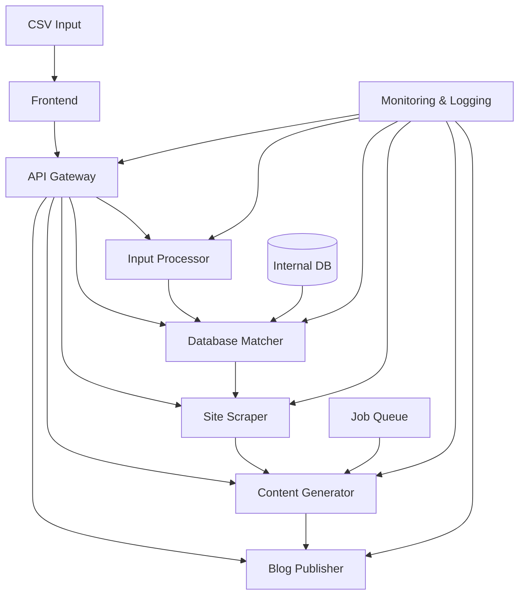

1. Frontend:
   - This is the user interface where users can upload the CSV file.
   - It communicates with the backend system through the API Gateway.
   - Responsibilities: File upload, user authentication, displaying results/progress.

2. API Gateway:
   - Acts as a single entry point for all client-side requests.
   - Routes requests to appropriate microservices.
   - Handles load balancing, caching, and security (authentication/authorization).
   - Implemented using Express.js or a specialized API Gateway like Kong.

3. Input Processor:
   - Receives the CSV file from the API Gateway.
   - Parses and validates the CSV data (Backlink, primary keyword, secondary keyword, DR ranges, Industry).
   - Prepares the data for further processing.
   - Uses libraries like csv-parser for efficient CSV handling.

4. Database Matcher:
   - Receives parsed input from the Input Processor.
   - Queries the Internal DB to find matching websites based on DR and Industry.
   - Selects the most appropriate websites for content placement.
   - Implemented using an ORM like Sequelize or Mongoose for database interactions.

5. Site Scraper:
   - Takes the matched websites from the Database Matcher.
   - Scrapes each website to gather information about its content, style, and target audience.
   - Generates a description of each website based on the scraped data.
   - Uses libraries like Puppeteer or Cheerio for web scraping.

6. Content Generator:
   - Receives website descriptions, keywords, and other relevant data.
   - Generates blog content tailored to each website's style and target audience.
   - May integrate with AI language models (e.g., GPT) for content creation.
   - Handles the bulk of the workload, generating 10K blogs daily.

7. Blog Publisher:
   - Takes the generated content from the Content Generator.
   - Publishes the blogs to the respective websites using their APIs or content management systems.
   - Handles authentication and posting logic for various platforms.
   - May implement retry mechanisms for failed publish attempts.

8. Job Queue:
   - Manages the high volume of content generation and publishing tasks.
   - Ensures even distribution of work and prevents system overload.
   - Implemented using message queue systems like RabbitMQ or Redis.

9. Internal DB:
   - Stores information about available websites (Site, Username, Password, DR, Industry).
   - Accessed by the Database Matcher to find appropriate content placement targets.
   - Could be implemented using PostgreSQL, MongoDB, or another suitable database system.

10. Monitoring & Logging:
    - Tracks the performance and health of all microservices.
    - Collects logs from each component for troubleshooting and auditing.
    - Provides alerts for any system issues or anomalies.
    - Implemented using tools like ELK stack (Elasticsearch, Logstash, Kibana) or Prometheus with Grafana.